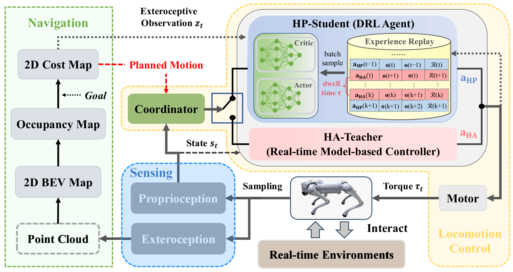
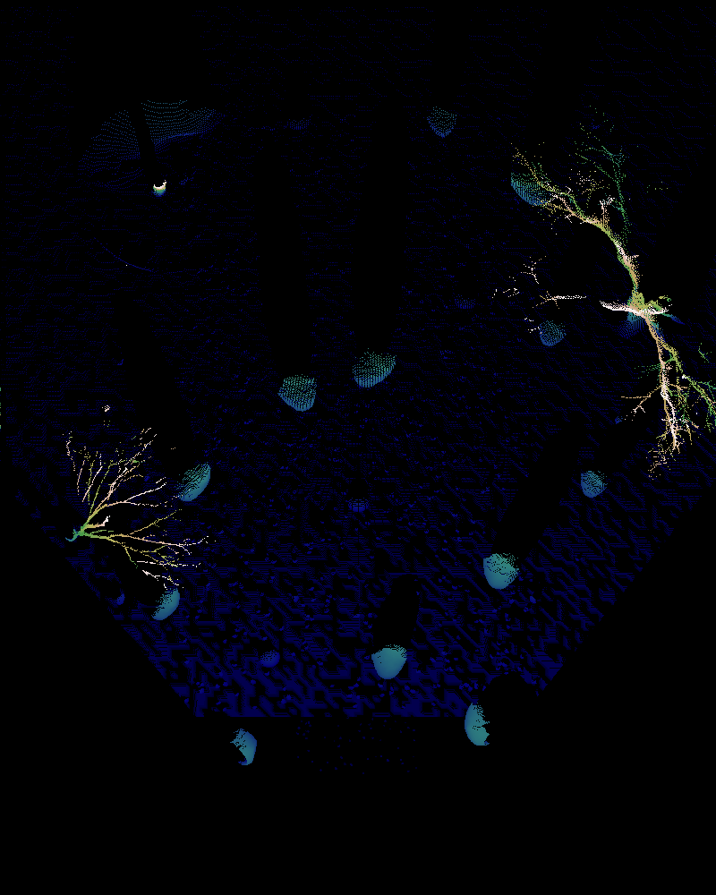
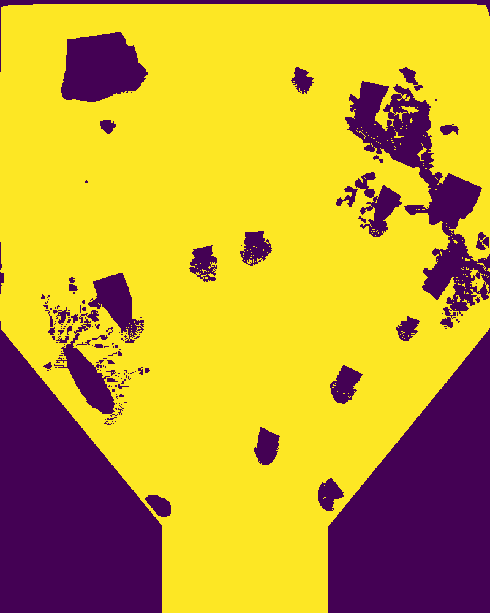
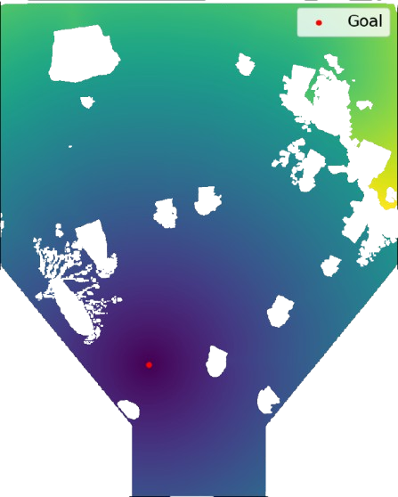
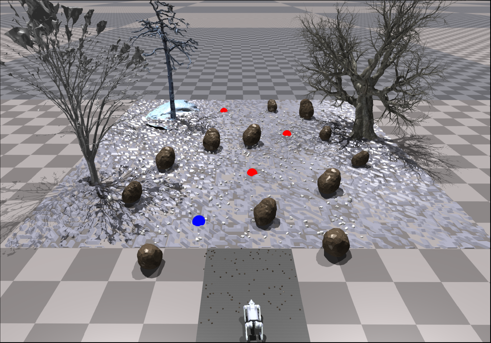

# Isaac-Runtime-Go2


---

This repo implements the **Runtime Learning Framework** on the Unitree-Go2 robot for the wild environments in Nivida
IsaacGym. In this framework, a closed-loop system is established for the quadruped robot by incorporating the *Sensing*,
*Navigation/Planning* and *Locomotion Control* module.
<p align="center">
  
 <br><b>Fig 1. Runtime Learning Framework -- A Close-loop System for the Quadruped Robot</b>
</p>

## User Guide

### ⚙️ Dependencies

* *Python - 3.8 or above*
* *PyTorch - 1.10.0*
* *Isaac Gym - Preview 4*

### 🔨 Setup

1. Clone this repository:

```bash
git clone git@github.com:Charlescai123/isaac-runtime-go2.git
```

2. Create the conda environment with:

```bash
conda env create -f environment.yml
```

3. Activate conda environment and Install `rsl_rl` lib:

```bash
conda activate runtime
cd extern/rsl_rl && pip install -e .
```

4. Download and install IsaacGym:

* Download [IsaacGym](https://developer.nvidia.com/isaac-gym) and extract the downloaded file to the root folder.
* navigate to the `isaacgym/python` folder and install it with commands:
* ```bash
  cd isaacgym/python && pip install -e .
  ```
* Test the given example (ignore the error about GPU not being utilized if any):
* ```bash
  cd examples && python 1080_balls_of_solitude.py
  ```

## 📍 Navigation

[//]: # (<p align="center">)

[//]: # (   )

[//]: # (   )

[//]: # (   )

[//]: # ( <br><b>Fig 1. Map Generation Pipeline &#40;left to right -- BEV Map, Occupancy Map, Cost Map&#41;</b>)

[//]: # (</p>)


| BEV Map                                      | Occupancy Map                                      | Cost Map                                     |
|----------------------------------------------|----------------------------------------------------|----------------------------------------------|
|  |  |  |


## Sim-to-Sim

---

We deploy a *sim-to-sim* policy (Phy-DRL) trained in the PyBullet environment on the A1 robot and transfer it to
IsaacGym for the Go2 robot.

<p align="center">
  
 <br><b>Fig 1. A Sim-to-Sim policy transfer in unforeseen Environment on Quadruped Go2</b>
</p>

- ### Phy-DRL

---

1. To evalidate trained **Phy-DRL** policy on quadruped Go2 robot, run following command:

```bash
python -m src.scripts.ddpg.eval --logdir=logs/train/ddpg_trot/demo --num_envs=1 --use_gpu=True
```

This experiment highlights the instability and safety issues of the pretrained policy in the unforeseen environment,
even
with the employment of domain randomization.

- ### Runtime Learning Framework

---

The **Runtime Learning Machine** is designed to ensure real-time responsiveness in safety-critical systems, effectively
handling unforeseen incidents arising from unknown environments.

<p align="center">
  

- **Safety Assurance:**

1. To evalidate **Runtime Learning Machine** for Phy-DRL on quadruped Go2 robot with an OOD (Out-of-Distribution) data,
   run command:

```bash
python -m src.scripts.ddpg.eval --logdir=logs/train/ddpg_trot/demo --num_envs=1 --use_gpu=True --enable_ha_teacher=True
```

<p align="center">
  
 <br><b>Fig 2. Runtime Learning Machine on Quadruped Go2 in unforeseen Environment</b>
</p>

2. To validate the safety performance of **Runtime Learning Machine** under random push, run command:

```bash  
python -m src.scripts.ddpg.eval --logdir=logs/train/ddpg_trot/demo --num_envs=1 --use_gpu=True --enable_ha_teacher=True --enable_pusher=True
```

<p align="center">
  
 <br><b>Fig 3. Safety Performance of Runtime Learning Machine under Random Push</b>
</p>

- **Runtime Learning:**

The **Runtime Learning Machine** facilitates the rapid adaptation of the quadrupedal Go2 robot to unseen environments:

```bash
python -m src.scripts.ddpg.train --use_gpu=True --enable_ha_teacher=True
```

## ⏳ To Do ##

<!-- * [x] Add BEV map to the repo -->
<!-- * [x] Fast Marching Method (FMM) implementation -->

* [-] Incorporate more challenging scenarios
    * [x] Dense forests (sandy terrain, trees)
    * [ ] inclined staircases, and rainy conditions
* [ ] Go2 real robot deployment
    * [ ] Gazebo real-time testing
    * [ ] ROS/ROS2 integration
* [ ] Restructure the code as FSM and add teleoperation (optional)
* [ ] Migration to Isaac-Lab

---

## 🏷️ Misc

---

- In order to plot the latest saved trajectory, run command `python -m src.utils.plot_trajectory`

---

## 📝 Citation

Please star or cite below papers if you find this repo helpful 🙏

```
@misc{cai2025runtimelearningquadrupedrobots,
      title={Runtime Learning of Quadruped Robots in Wild Environments}, 
      author={Yihao Cai and Yanbing Mao and Lui Sha and Hongpeng Cao and Marco Caccamo},
      year={2025},
      eprint={2503.04794},
      archivePrefix={arXiv},
      primaryClass={cs.RO},
      url={https://arxiv.org/abs/2503.04794}, 
}
```

```
@misc{cao2024simplexenabledsafecontinuallearning,
      title={Simplex-enabled Safe Continual Learning Machine}, 
      author={Hongpeng Cao and Yanbing Mao and Yihao Cai and Lui Sha and Marco Caccamo},
      year={2024},
      eprint={2409.05898},
      archivePrefix={arXiv},
      primaryClass={cs.LG},
      url={https://arxiv.org/abs/2409.05898}, 
}
```

---

## 🎉 Acknowledgments

Special thanks to the contributions from these repos:

- [rsl\_rl](https://github.com/leggedrobotics/rsl_rl.git): Template for standard Reinforcement Learning algorithms.
- [legged\_gym](https://github.com/leggedrobotics/legged_gym): Collection of simulation environments for legged robots.
- [cajun](https://github.com/yxyang/cajun): Some baseline code for model-based control of legged robots.
- [navigation-locomotion](https://github.com/MarkFzp/navigation-locomotion): Fast-Marching-Method and Motion Planning