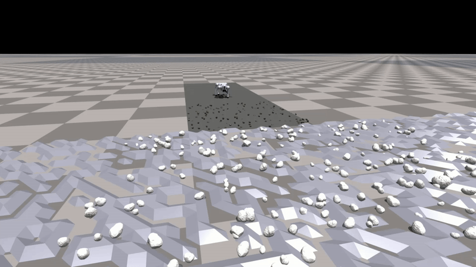

# Isaac-Wild-Go2


---

This repo implements the **Runtime Learning Framework** on the Unitree-Go2 robot for the wild environments in Nivida
IsaacGym. In this framework, a closed-loop system is established for the quadruped robot by incorporating the *Sensing*,
*Navigation/Planning* and *Locomotion Control* module.
<p align="center">
  
 <br><b>Fig 1. Runtime Learning Framework -- A Close-loop System for the Quadruped Robot</b>
</p>

## 💡 User Guide

### ⚙️ Dependencies

* *Python - 3.8 or above*
* *PyTorch - 1.10.0*
* *Isaac Gym - Preview 4*

### 🔨 Setup

1. Clone this repository:

```bash
git clone git@github.com:Charlescai123/isaac-wild-go2.git
```

2. Create the conda environment with:

```bash
conda env create -f environment.yml
```

3. Activate conda environment and Install `rsl_rl` lib:

```bash
conda activate isaac-wild
cd extern/rsl_rl && pip install -e .
```

4. Download and install IsaacGym:

* Download [IsaacGym](https://developer.nvidia.com/isaac-gym) and extract the downloaded file to the root folder.
* navigate to the `isaacgym/python` folder and install it with commands:
* ```bash
  cd isaacgym/python && pip install -e .
  ```
* Test the given example (ignore the error about GPU not being utilized if any):
* ```bash
  cd examples && python 1080_balls_of_solitude.py
  ```

5. Build and install the interface to Unitree's SDK:

* First, install the required packages `Boost` and `LCM`:

   ```bash
   sudo apt install libboost-all-dev liblcm-dev
   ```

* Then, go to `extern/go2_sdk` and create a build folder:
   ```bash
   cd extern/go2_sdk
   mkdir build && cd build
   ```

  Now, build the libraries and move them to the main directory by running:
   ```bash
   cmake ..
   make
   mv go2_interface* ../../..
   ```

## Runtime Learning Framework

---

### 📍 Navigation

[//]: # (<p align="center">)

[//]: # (   )

[//]: # (   )

[//]: # (   )

[//]: # ( <br><b>Fig 1. Map Generation Pipeline &#40;left to right -- BEV Map, Occupancy Map, Cost Map&#41;</b>)

[//]: # (</p>)

| BEV Map                                      | Occupancy Map                                      | Cost Map                                     |
|----------------------------------------------|----------------------------------------------------|----------------------------------------------|
|  |  |  |

### 🦿 Locomotion

---


The locomotion control module provides real-time response in safety-critical systems, effectively
handling unforeseen incidents arising from unknown environments.

[//]: # (<p align="center">)

[//]: # (  )

#### 1️⃣ Safety Assurance (Runtime Learning)

---

A key objective of this framework is to ensure the robot's safety during runtime learning, achieved through a
hybrid control system with a switching mechanism design:

🔹 when the robot base turns **Blue** ➡️ robot is controlled by **HP-Student**.
  
🔺 when the robot base turns **Red** ➡️ robot is controller by **HA-Teacher**.

| With Runtime-Learning Framework                         | Without the Framework                                 |
   |---------------------------------------------------------|-------------------------------------------------------|
|  |  |


#### ️2️⃣ **Compare with Other Model-based Controller**

---

HA-Teacher is a real-time, physics-based safety controller utilizing a dynamic model (**Real-Time Patch**), holding
superior performance compared to safety controllers that rely on time-invariant (e.g., **Fixed**) models. The comparison
on wild, uneven terrain is demonstrated:

| Real-Time Patch (under random push)                         | Fixed Robot Model                                          |
|-------------------------------------------------------------|------------------------------------------------------------|
|  |  |

[//]: # (- **Runtime Learning:**)

[//]: # ()
[//]: # (The **Runtime Learning Machine** facilitates the rapid adaptation of the quadrupedal Go2 robot to unseen environments:)

[//]: # ()
[//]: # (```bash)

[//]: # (python -m src.scripts.ddpg.train --use_gpu=True --enable_ha_teacher=True)

[//]: # (```)

## ⏳ To Do ##

<!-- * [x] Add BEV map to the repo -->
<!-- * [x] Fast Marching Method (FMM) implementation -->

* [-] Incorporate more challenging scenarios
    * [x] Dense forests (sandy terrain, trees)
    * [ ] inclined staircases, and rainy conditions
* [ ] Go2 real robot deployment
    * [ ] Gazebo real-time testing
    * [ ] ROS/ROS2 integration
* [ ] Restructure the code as FSM and add teleoperation (optional)
* [ ] Migration to Isaac-Lab

---

## 🏷️ Misc

---

- In order to plot the latest saved trajectory, run command `python -m src.utils.plot_trajectory`

---

## 📝 Citation

Please star or cite below papers if you find this repo helpful 🙏

```
@misc{cai2025runtimelearningquadrupedrobots,
      title={Runtime Learning of Quadruped Robots in Wild Environments}, 
      author={Yihao Cai and Yanbing Mao and Lui Sha and Hongpeng Cao and Marco Caccamo},
      year={2025},
      eprint={2503.04794},
      archivePrefix={arXiv},
      primaryClass={cs.RO},
      url={https://arxiv.org/abs/2503.04794}, 
}
```

```
@misc{cao2024simplexenabledsafecontinuallearning,
      title={Simplex-enabled Safe Continual Learning Machine}, 
      author={Hongpeng Cao and Yanbing Mao and Yihao Cai and Lui Sha and Marco Caccamo},
      year={2024},
      eprint={2409.05898},
      archivePrefix={arXiv},
      primaryClass={cs.LG},
      url={https://arxiv.org/abs/2409.05898}, 
}
```

---

## 🎉 Acknowledgments

Special thanks to the contributions from these repos:

- [rsl\_rl](https://github.com/leggedrobotics/rsl_rl.git): Template for standard Reinforcement Learning algorithms.
- [legged\_gym](https://github.com/leggedrobotics/legged_gym): Collection of simulation environments for legged robots.
- [cajun](https://github.com/yxyang/cajun): Some baseline code for model-based control of legged robots.
- [navigation-locomotion](https://github.com/MarkFzp/navigation-locomotion): Fast-Marching-Method and Motion Planning